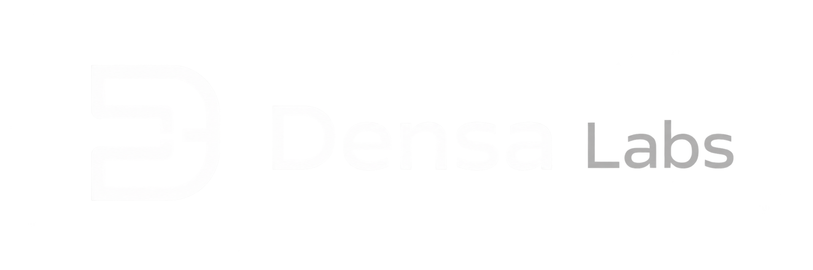

# Densa Labs

Densa Labs is an independent software lab building useful software, developer tools, and experimental projects.

# Current projects

<picture>
  <source media="(prefers-color-scheme: dark)" srcset="assets/Benchmark-Registry-Logo-Full-White.png">
  <source media="(prefers-color-scheme: light)" srcset="assets/Benchmark-Registry-Logo-Full-Dark.png">
  
</picture>

## Benchmark Registry

A structured registry for AI models and their evaluation results.

# Information

Website: https://densa-labs.github.io/

---

Densa Labs
